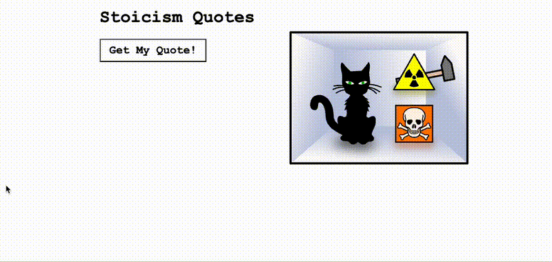

# Stoicism Quote Generator
This project was built to practice using the fetch to to connect to an API and return data.

[View Live Project](https://heidifryzell.com/stoicism-quote/)

### Tech Used:
 

## Related Projects
Here is my current portfolio:

<table border="1">
  <tr>
    <td style="text-align: center;"><a href="https://heidifryzell.com">heidifryzell.com</a></td>
  </tr>
  <tr>
    <td></td>
  </tr>
</table>
